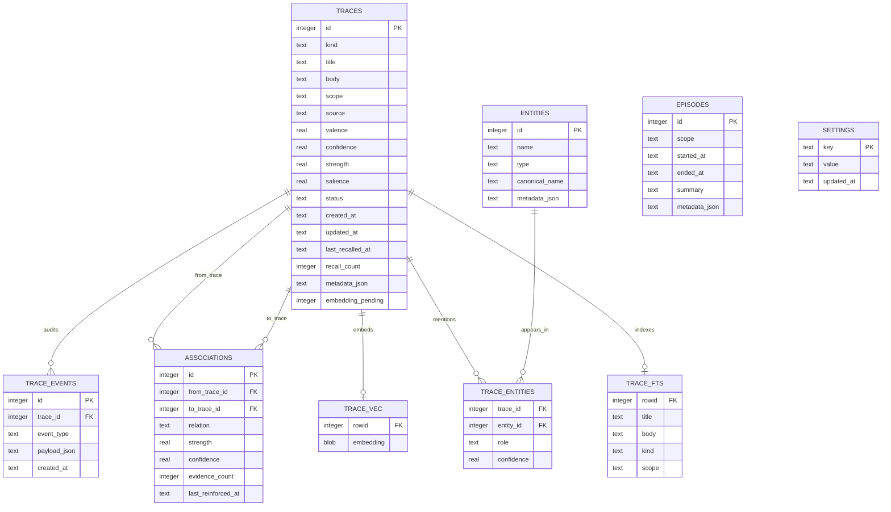

# Hebb

Hebb is a local-first long-term memory engine for AI agents.

> The name comes from Donald Hebb and the phrase: "Neurons that fire together wire together."
>
> Hebb applies that idea to agent memory: facts, observations, decisions and entities that appear together can become associated, reinforced and easier to retrieve over time.

Hebb is not just another vector database. It is a local memory layer for agents, built around traces, entities, associations, retrieval, reinforcement, inhibition and consolidation.

## Principles

- 100% local-first
- One Go binary
- One SQLite database file
- Data stored by default in `~/.hebb/hebb.db`
- SQLite FTS5 for lexical search
- `sqlite-vec` for vector search inside SQLite
- Ollama for local embeddings
- Default embedding model: `mxbai-embed-large`
- MCP-first for AI agents
- No Postgres, Redis, Neo4j, Qdrant, Chroma or cloud service required

## Quick Start

```bash
ollama pull mxbai-embed-large
task build
hebb init
hebb encode --kind fact --title "Hebb is local" --body "Hebb stores memory in ~/.hebb/hebb.db with SQLite, FTS5 and sqlite-vec."
hebb retrieve "how does Hebb store memory?"
hebb mcp
```

Hebb uses `go-sqlite3` with SQLite FTS5, so local builds should use the project Taskfile or pass `-tags sqlite_fts5` manually.

## Use Cases

Hebb is useful when an agent needs durable local memory without sending data to a hosted database or vector service.

- **Project memory for coding agents**: store architectural decisions, repository conventions, recurring bugs, release procedures and important file/entity relationships per repo scope.
- **Personal assistant memory**: remember durable preferences, repeated instructions, important facts and long-running plans without storing raw conversation dumps.
- **Operational runbooks**: encode procedures, warnings, incident observations and postmortem decisions, then retrieve them by service, scope or related entity.
- **Research notebooks**: save observations, questions, facts and semantic summaries while associating related traces across topics.
- **Agent coordination**: expose a local MCP server so multiple tools or agents can retrieve and reinforce the same memory base.
- **Offline/private semantic recall**: combine SQLite FTS5, local Ollama embeddings and associative links while keeping the database in `~/.hebb/hebb.db`.

## Data Location

By default, Hebb stores all local data under:

```text
~/.hebb/
```

The main database is:

```text
~/.hebb/hebb.db
```

For tests or custom setups, use `HEBB_HOME`, `HEBB_DB_PATH`, `--home` or `--db`.

## CLI

```bash
# Creates ~/.hebb/hebb.db, applies the schema and tries to detect the local embedding dimensions.
hebb init

# Checks SQLite, sqlite-vec, configured paths and Ollama availability.
hebb doctor

# Stores a durable memory trace and links optional entities.
hebb encode --kind decision --title "Use sqlite-vec" --body "Hebb keeps vectors inside SQLite." --entity Hebb --scope /repo

# Retrieves memory using structured filters, FTS5 and vector search when embeddings are available.
hebb retrieve "how does Hebb store vectors?" --scope /repo --limit 10

# Creates or reinforces an associative edge between two traces.
hebb associate 1 2 --relation supports

# Increases strength, salience and confidence after a trace is useful or confirmed.
hebb reinforce 1 --reason "used_in_answer"

# Lowers priority for stale, noisy or contradicted memory without deleting it.
hebb inhibit 2 --reason "stale_or_noisy"

# Marks a trace as forgotten by default. Hard delete requires --hard --yes.
hebb forget 2 --soft

# Creates a conservative semantic summary for a scope and marks active traces as consolidated.
hebb consolidate --scope /repo

# Inspects traces, entities or aggregate memory statistics.
hebb inspect trace 1
hebb inspect entity Hebb
hebb inspect stats

# Runs maintenance jobs such as embedding backfill or gradual decay.
hebb maintain embed --pending
hebb maintain decay --dry-run

# Starts the MCP server over stdin/stdout for agent integrations.
hebb mcp

# Configures an agent to use Hebb proactively. Without --apply, prints the plan.
hebb agent install --agent codex --apply
hebb agent install --agent claude --apply

# Internal lifecycle entrypoints used by installed hooks.
hebb agent hook session-start
hebb agent hook user-prompt-submit
hebb agent hook stop
```

Aliases:

- `remember` -> `encode`
- `recall` -> `retrieve`
- `link` -> `associate`

## Agent Integration

Hebb can configure supported agents so memory is used naturally during normal interaction. The goal is that the agent retrieves useful context at the start of work and saves durable learnings as they appear, without requiring prompts like "search the MCP" or "save this to memory".

Preview the install plan:

```bash
hebb agent install --agent codex
hebb agent install --agent claude
```

Apply the integration:

```bash
hebb agent install --agent codex --apply
hebb agent install --agent claude --apply
```

Codex installation registers the `hebb` MCP server and writes managed memory instructions to `~/.codex/AGENTS.md`.

Claude installation writes the `hebb` MCP server to `~/.claude/mcp.json`, adds lifecycle hooks to `~/.claude/settings.json`, and writes managed memory instructions to `~/.claude/CLAUDE.md`.

Installed Claude hooks call:

```bash
hebb agent hook session-start
hebb agent hook user-prompt-submit
hebb agent hook stop
```

The hooks load relevant memory as additional context and conservatively capture durable-looking user prompts, such as explicit preferences, decisions, procedures and conventions. `stop` is intentionally non-capturing by default to avoid saving generic final answers, command outputs or task-status chatter. Hebb intentionally avoids saving every raw transcript line; memory should stay useful, not noisy.

## Data Model

Hebb stores memories as traces. Traces can be connected to entities, linked to each other by associations and audited through trace events. FTS5 mirrors trace text for lexical search, while `trace_vec` stores optional local embeddings when Ollama is available. Episodes are stored as temporal summary records in the MVP; explicit trace-to-episode linking can be added later if needed.



## MCP

```json
{
  "mcpServers": {
    "hebb": {
      "command": "hebb",
      "args": ["mcp"]
    }
  }
}
```

## Status

This repository contains a functional MVP: SQLite storage, FTS5 lexical search, `sqlite-vec` registration, Ollama embedding calls with pending-vector fallback, trace/entity/association persistence, lifecycle commands, maintenance commands and a minimal MCP JSON-RPC server.

If Ollama is unavailable, `encode` stores traces with `embedding_pending = true`, `retrieve` falls back to FTS5 and structured search, and `hebb maintain embed --pending` can backfill vectors later.
